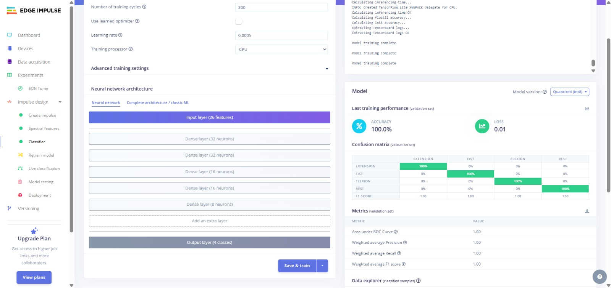
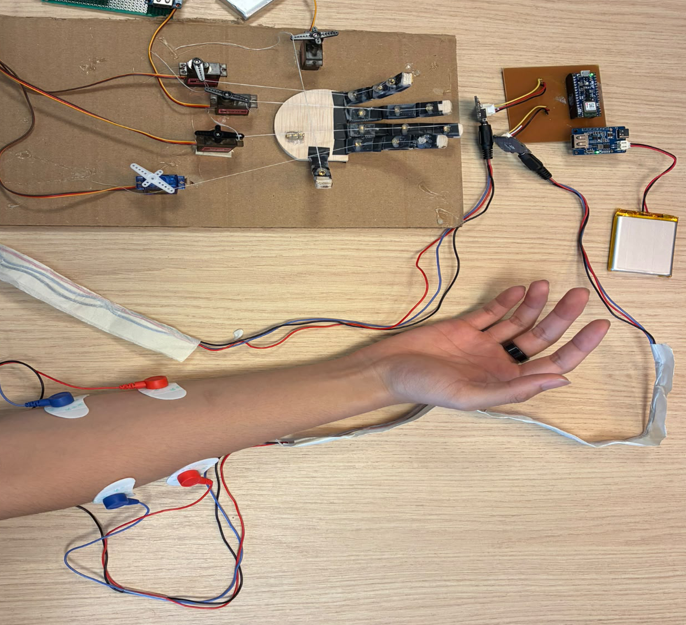

# TheFlexProtocol

The project uses Arduino Nano 33 BLE Sense Rev2 to read EMG signals from two Grove EMG sensors, classifies the gesture using a TinyML model (Edge Impulse), and broadcasts the prediction over BLE to a Raspberry Pi Pico W, which actuates a 5-finger robotic hand via servos. A separate ESP32 (LilyGo T-Display) subsystem listens for BLE manufacturer data from the Nano and displays it on screen.

## Project Structure

```
assets/         # Images and media for documentation
firmware/
├── esp/          # ESP32 LilyGo T-Display - BLE scanner + screen display (PlatformIO)
├── external/     # Shared ESP32Servo library source (used by esp/lib)
├── nano/         # Arduino Nano 33 BLE Sense Rev2 - EMG sampling + TinyML inference + BLE broadcast (PlatformIO)
├── pico_w/       # Raspberry Pi Pico W - BLE receiver + servo-driven robotic hand (CMake / pico-sdk)
└── TinyML/       # Custom training pipeline for the EMG gesture model, currently experimenting on a public dataset
tools/            # Standalone data-collection sketch for Edge Impulse forwarder
```

---

## TinyML Model

The EMG gesture classifier is trained on Edge Impulse, using data collected with the `tools/emg_edge_impulse_forwarder.ino` script. The exported inference library (pre-demo_project_emg_sensors_inferencing) is what `nano/src/main.cpp` runs on-device.

### Model Performance



Validation accuracy: 100% with 0.01 loss across 4 gesture classes (EXTENSION, FIST, FLEXION, REST), with a perfect confusion matrix and F1 score of 1.00 for every class.

`firmware/TinyML/Notebook/` contains a separate, self-contained training pipeline currently experimenting on a public dataset (see notebook for the dataset link). Everything inside `TinyML/` belongs to this notebook/experimentation track and is separate from what is currently deployed on the Nano.

To collect new training data for Edge Impulse, flash `tools/emg_edge_impulse_forwarder.ino` to the Nano and use the Edge Impulse data forwarder.

**Edge Impulse project:** [pre-demo project emg sensors](https://studio.edgeimpulse.com/public/1022943/live)

---

## Building & Flashing

### 1. Nano 33 BLE Sense Rev2 (EMG classifier)

Requires the [PlatformIO extension](https://platformio.org/install/ide?install=vscode) for VS Code.

```bash
cd firmware/nano
pio run -e nano33ble -t upload
```

- `pio run -e nano33ble` - build only the main firmware
- `pio run -e nano33ble-test -t upload` or `pio test -e nano33ble-test` - build/run the EMG unit test
- `pio run` - builds **both** environments

### 2. ESP32 LilyGo T-Display (BLE display)

```bash
cd firmware/esp
pio run -e lilygo-t-display -t upload
```

- `pio run -e lilygo-t-display` - build only the main firmware
- `pio run -e esp32-test` or `pio test -e esp32-test` - build/run the gesture recognition test
- `pio run` - builds **both** environments

### 3. Raspberry Pi Pico W (robotic hand)

Requires [pico-sdk](https://github.com/raspberrypi/pico-sdk) installed and `PICO_SDK_PATH` set.

```bash
cd firmware/pico_w
mkdir build && cd build
cmake ..
make
```

Flash the resulting `.uf2` file (in `build/`) by holding **BOOTSEL** while plugging in the Pico W, then drag-and-drop the file onto the mounted drive.

> Note: `firmware/external/` contains shared library source used by `firmware/esp` during build.

### Why different build systems?

- **`nano/`** and **`esp/`** use **PlatformIO** with the Arduino framework.
- **`pico_w/`** uses **CMake + pico-sdk** directly, because BLE (BTstack) on the Pico W requires the raw SDK - PlatformIO's Arduino framework for RP2040 doesn't expose this.

This split is intentional and not worth unifying.

---

## Wiring

### Nano 33 BLE Sense Rev2 - Grove EMG sensors

| EMG sensor pin | Nano pin |
| -------------- | -------- |
| Power          | 3.3V     |
| Ground         | GND      |
| Sensor 1 data  | A0       |
| Sensor 2 data  | A1       |

### Pico W - Servo connections

| Finger              | GPIO             |
| ------------------- | ---------------- |
| Pinkie              | GPIO 2           |
| Ring                | GPIO 3           |
| Middle              | GPIO 4           |
| Point               | GPIO 5           |
| Thumb               | GPIO 6           |
| All servos - power  | Pico W 5V (VBUS) |
| All servos - ground | Pico W GND       |

### ESP32 LilyGo T-Display

No external wiring required - onboard display and BLE only.

---

## EMG Setup Notes

EMG signals are very sensitive to movement artifacts and electrical noise, which can be picked up by the sensor wires.

- Keep wires and electrodes **completely still** during a session - any movement of the cables introduces noise.
- Keep the sensor and wires **away from other electronics** (chargers, laptops, phones) while recording or running inference.

### Demo setup



_Note: In this image, the Pico W and the ESP32 are not visible. During an actual demo, the Pico W controls the servos based on predictions, while the ESP32 displays the prediction output._

Each board (Nano, ESP32, Pico W) sits on its own small adapter PCB with a connected LiPo (rechargeable) battery for portable/wireless operation. Each can alternatively be powered via USB cable to a laptop, which also gives access to the serial monitor for debugging.

### Electrode placement

Two electrode pairs (4 colored pads total) are placed on the forearm, one pair per muscle:

- **Flexor carpi radialis** - one pad over the muscle belly, one pad over the tendon (reference)
- **Extensor digitorum** - one pad over the muscle belly, one pad over the tendon (reference)

Additionally, **2 black ground electrodes** are placed on a bony/non-muscular part of the arm near the elbow.

Notes:

- **Mark the placement spots** (e.g. with a skin-safe marker) so the same positions can be reused across sessions - placement drift changes signal characteristics and affects model accuracy.
- Before applying pads: clean the skin with alcohol and shave the area if needed, for better skin contact and adhesion.
- Try to record/test under similar conditions (time of day, skin temperature) for consistency.

---

## BLE Communication

| Link            | Purpose                                                                |
| --------------- | ---------------------------------------------------------------------- |
| Nano --> Pico W | Gesture classification result --> servo pose command                   |
| Nano --> ESP32  | Manufacturer data broadcast --> on-screen display (separate prototype) |

Pico W GATT service UUID: `c3feed70-b50c-400a-836c-c8981beb0b1c`
